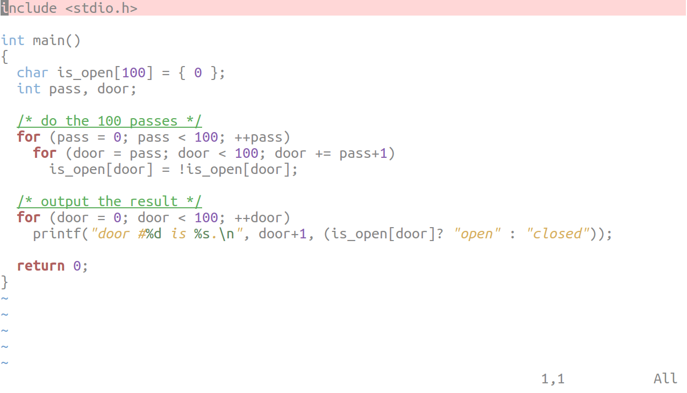
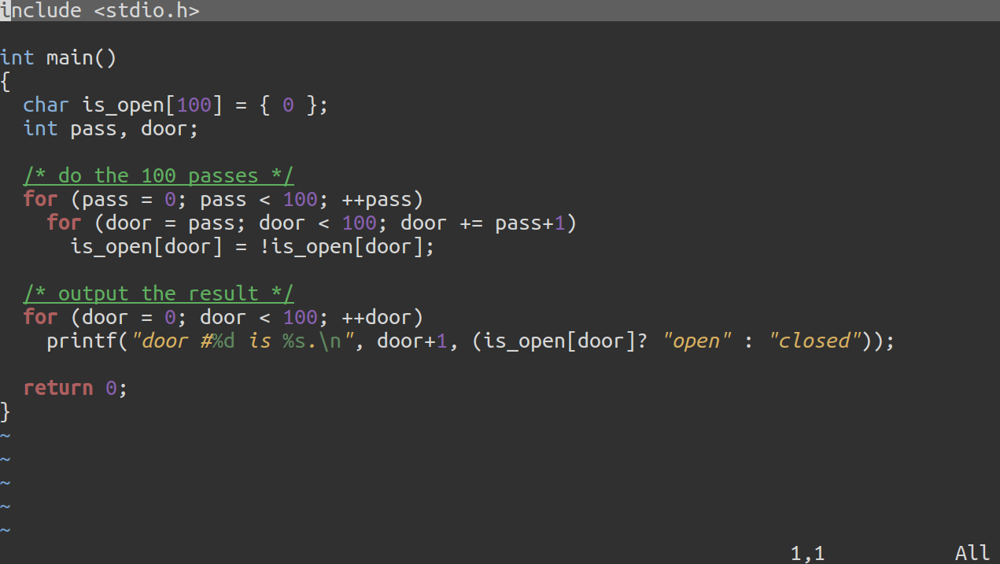
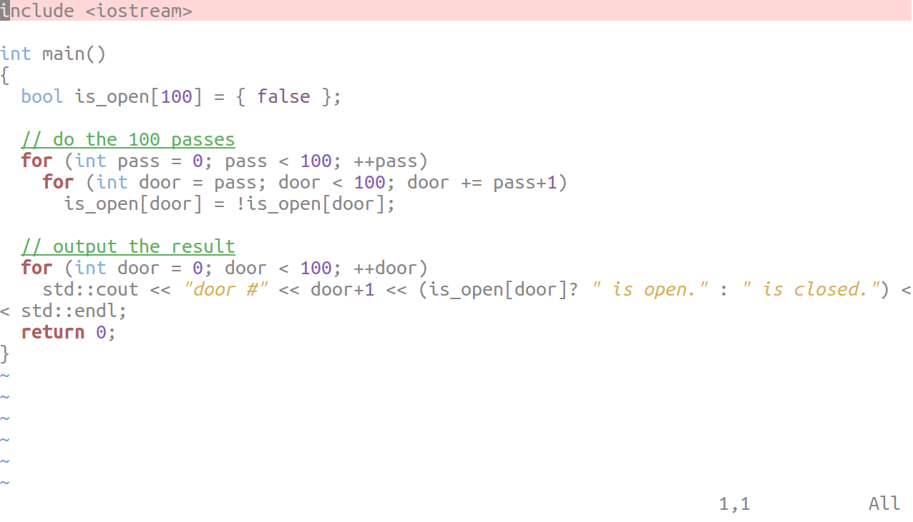
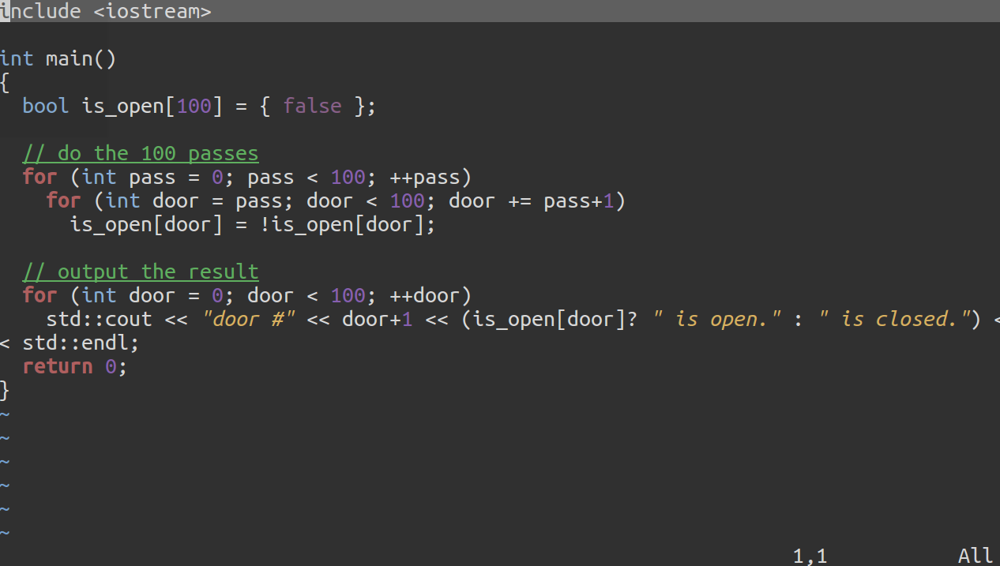
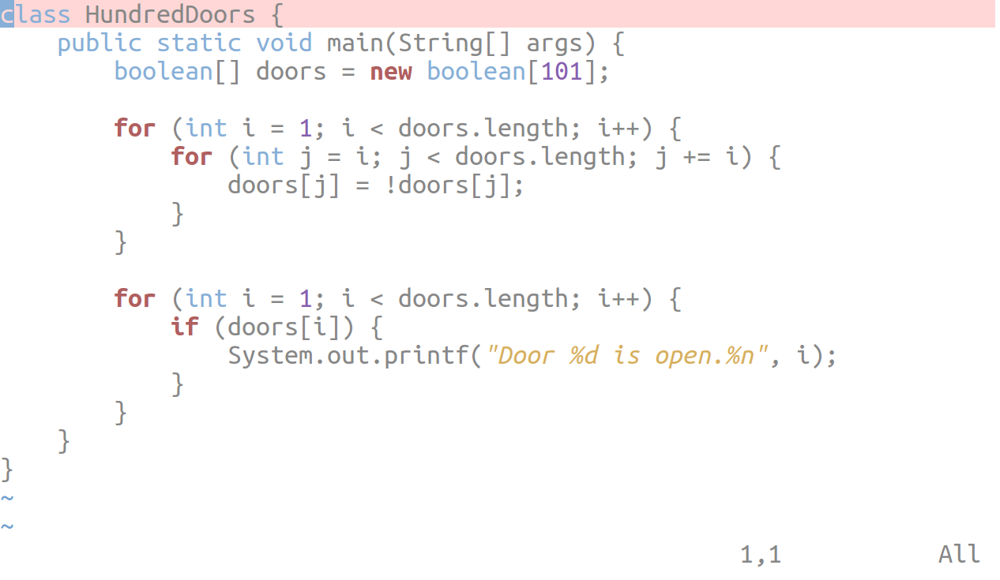
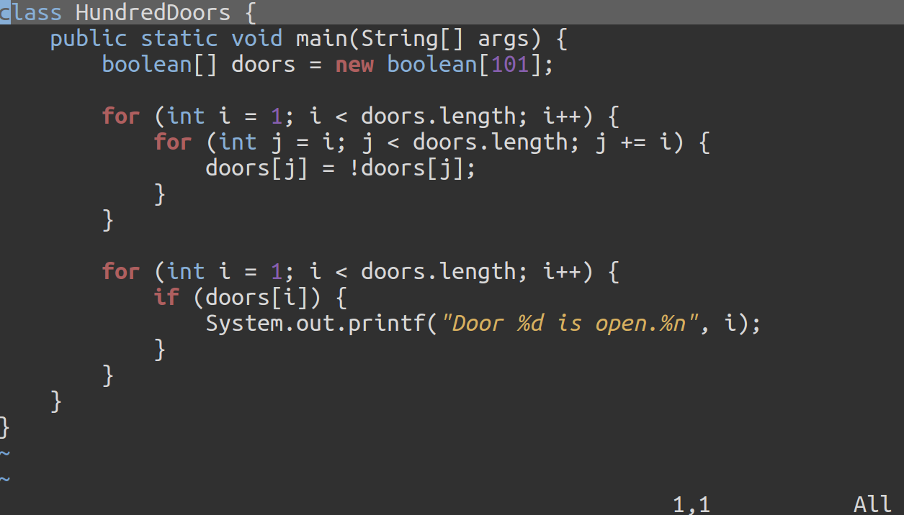
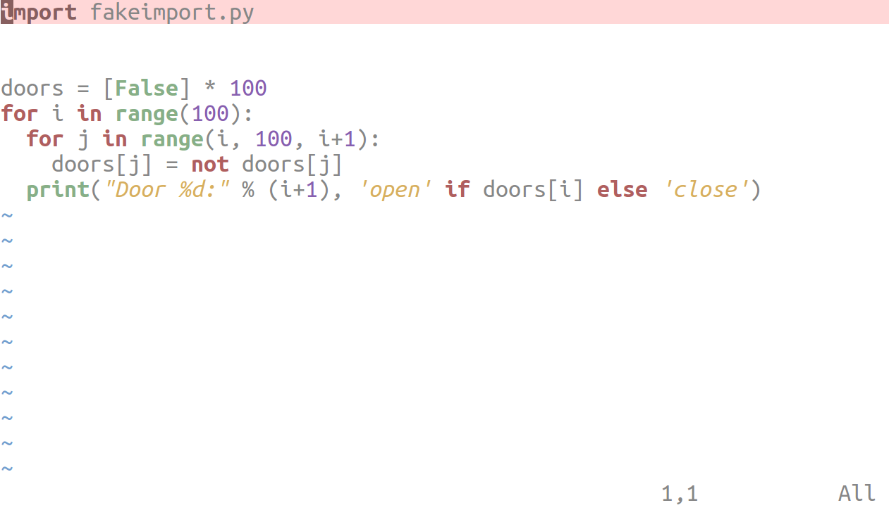
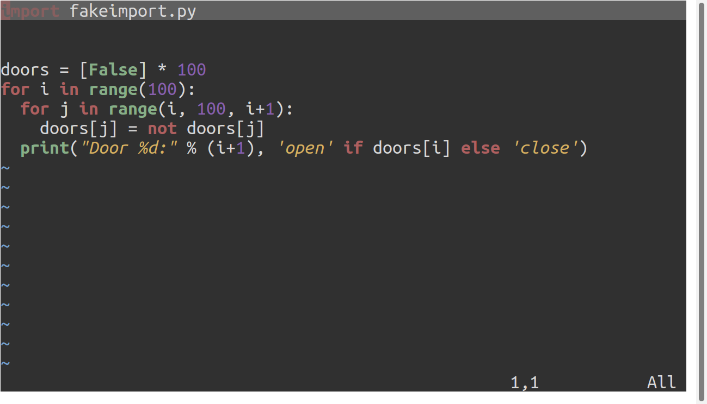

# donttouchme
`donttouchme` is a colorscheme (colourscheme if you spell it properly) for Vim, and works both for the Vim GUI and terminal (provided your terminal supports xterm-256 colours).

# light and dark
`donttouchme` comes in two flavours: light and dark. The dark version of `donttouchme` is called `chalkboard`.

|     | `donttouchme` | `chalkboard` |
| --- | ------------- | ------------ |
| C |  |  |
| C++ |  |  |
| Java |  |  |
| Python |  |  |

Note: Sample code taken from https://github.com/acmeism/RosettaCodeData to display syntax highlighting colorscheme.

# colour significance
The colours for `donttouchme` were selected keeping in mind the muted warmth of such movies as _Her (2013)_ and the pastel paradise of your favourite Wes Anderson film.The colorscheme revolves around a grungier version of the three primary colours: red, yellow, and blue; with low-saturated secondary colours used as complements.

# how to use
1. First clone or download the repository, and copy/move the .vim files to your ~/.vim/colors directory (if there is no such directory, create one).
2. Invoke the `donttouchme` colorscheme with the command `:colo donttouchme`; invoke the `chalkboard` colorscheme with the command `:colo chalkboard` in the Vi editor.
3. Add `colo <colorscheme>` to your `.vimrc` to make them default.

